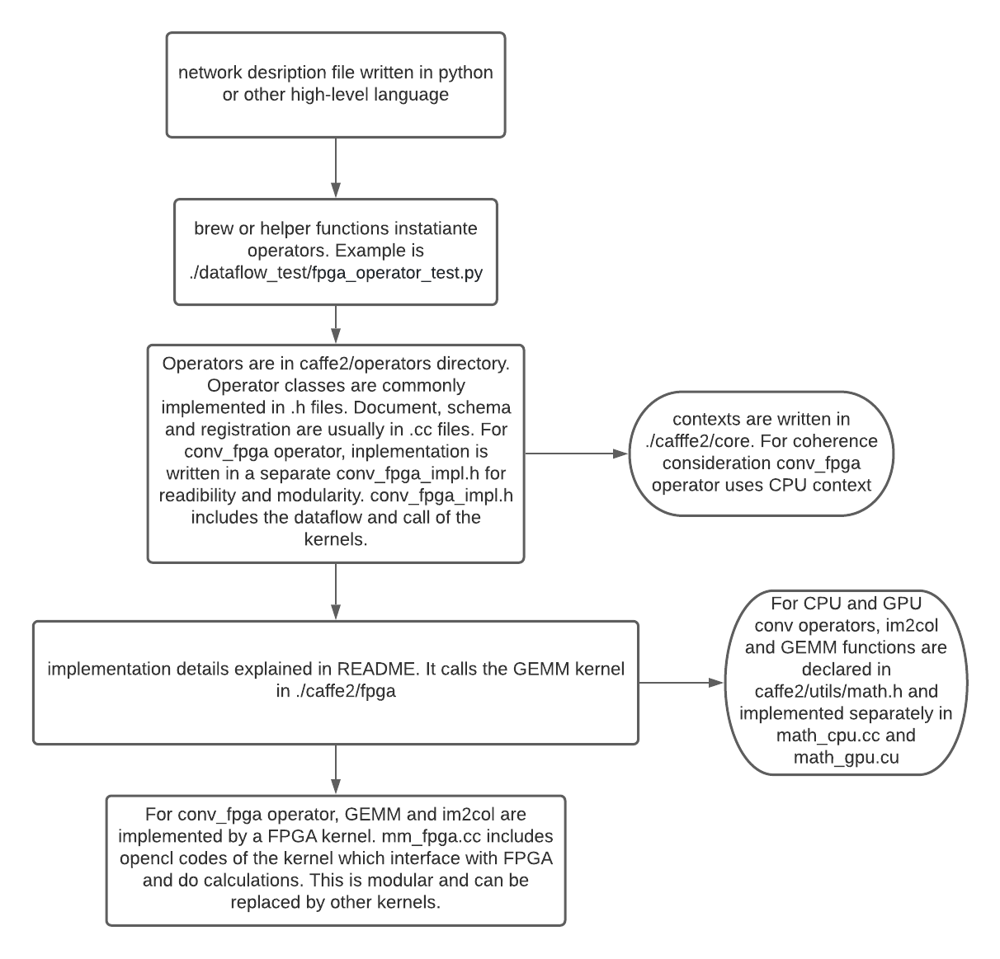

# Caffe2 with FPGA GEMM kernel

FPGAs are potentially more power efficient and allow parallelism comparing with CPUs. An conv_fpga_op is added to the caffe2 framework. This operator calls the Kernel under ~/caffe2/fpga directory and performs im2col and GEMM operations on FPGA. In consideration of modularity and coherence, FPGA kernel is implemented as a separate operator instead of mixing with conv_op for CPU and GPU context. Dataflow is verified and results and testing scripts are available in ~/dataflow_test.

- [Implementation details](#implementation-details)
- [Installation](#installation)
- [Caffe2 structure](#caffe2-structure)

## Implementation details

### ~/caffe2/operators/conv_fpga_op.cc
Includes operator schema and documentation of our new operator. REGISTER_CPU_OPERATOR macro binds Conv_fpga function to Conv_fpga_Op operator. This operator takes two necessary inputs(input X and filter) and one optional input(bias) and goves one output(Y).

### ~/caffe2/operators/conv_fpga_op.h
Declares a class Conv_fpga_Op marked final(not allowed to be inherited from) which inherits from class ConvPoolOpBase. The implementations of class member functions are in a separate implementation file for clarity and readibility of the code.

### ~/caffe2/operators/conv_op_fpga_impl.h
Contains implementation of member functions in class Conv_fpga_Op. Member function RunOnDeviceWithOrderNCHW loads inputs and calls the kernel function under /caffe2/fpga directory and then generates the output Y. This is made separate instead of directly reusing conv_op_impl.h for CPU and GPU operation because the latest kernel we use does both im2col and GEMM on FPGA in order to save data transfer time and optimise memory usage.

### ~/caffe2/fpga/mm_fpga.cc
Includes the Kernel function. It sets up the interface to FPGA device and calls functions from the XRT library to instantiate and execute the mesh processor defined in .xclbin file on FPGA to do the GEMM operation.


*CMakeLists are modified for each directory to add reference to our new function. For future developments and changes if seeing compilation error about undefined reference, please check whether the functions are added to CMakeLists properly.

## Installation

This repository utilises caffe2. To use it you will need Python 3.6 or later and a C++14 compiler.
Below are the steps to build and run this project on Centos7.

### Step 1) Install miniconda3 and create a new environment with python 3.6 or later.
```
wget https://repo.anaconda.com/miniconda/Miniconda3-latest-Linux-x86_64.sh

chmod +777 Miniconda3-latest-Linux-x86_64.sh

./Miniconda3-latest-Linux-x86_64.sh

source ~/.bashrc

conda create --name fpga_caffe2 python=3.6
```


### Step 2) Activate a GCC compiler higher than GCC 5.4.0, otherwise there's compilation error. Here we used GCC 9.
```
scl enable devtoolset-9 bash
```

### Step 3) Setup the conda environment
```
conda activate fpga_caffe2

conda install numpy ninja pyyaml mkl mkl-include setuptools cmake cffi typing_extensions future six requests

```
### Step 4) Get the source code and setup environment variable for build.
```
git clone --recursive https://github.com/Jirui-Wu/fpga_caffe2.git

cd fpga_caffe2

export CMAKE_PREFIX_PATH=${CONDA_PREFIX:-"$(dirname $(which conda))/../"}

export USE_CUDA=0

export USE_LMDB=ON

source /opt/xilinx/xrt/setup.sh

source /tools/Xilinx/Vitis/2019.2/settings64.sh
```

### Step 5) Install fpga_caffe2
```
python setup.py install
```
## Caffe2 structure

